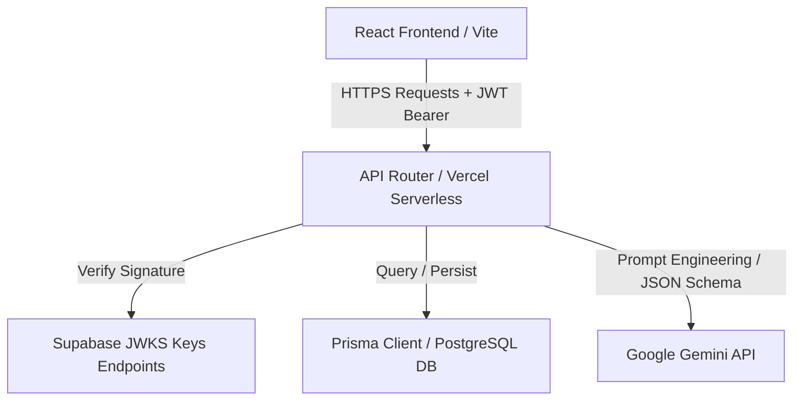

# CareerCopilot

CareerCopilot is an AI-powered career preparation and interview readiness SaaS platform. It transforms standard career prep workflows into structured, gamified milestones that help engineering candidates optimize their profiles, evaluate communication pacing, and track job applications end-to-end.

## Overview
Preparing for elite tech roles requires aligning multiple facets: resume keyword indexing, algorithmic problem-solving speed, technical/behavioral communication, and a organized job search pipeline. CareerCopilot bridges these gaps by providing an automated career readiness command center. Using Google Gemini models for personalized planning and Supabase for secure identity authentication, the application persists a candidate's progress directly to a PostgreSQL database.

---

## Core Features
*   **AI Career Roadmap Generation**: Input your target engineering role, timelines, and study schedules to compile week-by-week goals.
*   **ATS Resume Optimizer & Parser**: Parse raw resume text and scan for missing keywords, formatting errors, and metric-based accomplishments.
*   **AI Bullet Optimization Comparison**: Click *Apply AI Fix* to generate metric-rich rewrites for weak resume bullets. Edit, compare, and apply suggestions in a side-by-side modal.
*   **ATS-Friendly PDF Export**: Export your updated resume into an ATS-compliant, single-column print layout directly in the browser.
*   **AI Interactive Interview Coach**: Engage in behavioral, technical, or system design audio/text screens. The interviewer custom-generates questions and evaluates pacing, confidence, and answer quality.
*   **Kanban Job Search Pipeline**: Track target companies across key hiring stages (Wishlist, Applied, Interview, Offer) with priority flags and stage count badges.
*   **Algorithmic DSA Tracker**: Log solved problems categorized by difficulty (Easy, Medium, Hard) relative to daily goals, rewarding users with XP and streak increases.
*   **Gamified Home Dashboard**: A central command center displaying daily checklists, XP, solved statistics, and dynamic skill gap competency bars.

---

## Tech Stack

### Frontend
*   **React** (v19)
*   **TypeScript** (v5)
*   **Vite** (v6)
*   **Tailwind CSS** (v4)
*   **jsPDF** for client A4 PDF generation

### Backend
*   **Node.js**
*   **Express**
*   **Jose** / **Jsonwebtoken** for JWKS token verification

### Database & ORM
*   **PostgreSQL**
*   **Prisma ORM**

### Infrastructure & Services
*   **Supabase** (Authentication & Identity Provider)
*   **Google Gemini AI API** (Asymmetric Large Language Models)
*   **Vercel** (Serverless hosting)

---

## Architecture



1.  **Client-Side UI**: Formulated with Tailwind CSS and React Router. Captures token sessions from Supabase.
2.  **API Gateway**: Express routes verify requests by querying the Supabase JWKS signature endpoint to validate asymmetric ES256/RS256 algorithms.
3.  **ORM / Database Engine**: Models are validated against a local Prisma schema, generating typesafe client bindings representing PostgreSQL public tables.
4.  **AI Engine**: Integrates Gemini models with structured JSON schemas, returning structured responses for roadmaps, resume analyses, and interview grading.

---

## Authentication Architecture
CareerCopilot uses a production-grade, secure authentication architecture:
*   Users register and log in via the Supabase client wrapper.
*   Every request to backend routes passes a JWT token in the `Authorization: Bearer <token>` header.
*   The Express backend intercepts the token and decodes the JWT header to extract the key ID (`kid`).
*   It retrieves Supabase's public keys from the official JWKS endpoint:
    `https://<project-id>.supabase.co/auth/v1/.well-known/jwks.json`
*   The signature is verified locally using the matched key, enforcing asymmetric algorithm validation (ES256/RS256).
*   Upon successful signature validation, the subclaim (`sub`) is bound to the request context as the verified user ID, preventing cross-user database access.

---

## Database Schema Design
The database structure is defined in `prisma/schema.prisma` and consists of the following key tables:

*   **`User`**: Core table mapping authenticated users to their corresponding profiles and resources.
*   **`Profile`**: Holds personal stats, target roles, solved DSA count caches (`easySolved`, `mediumSolved`, `hardSolved`), streak counts, and target study timelines.
*   **`Resume`**, **`ResumeVersion`**, **`ResumeAnalysis`**: Relational structure supporting multiple resume upload versions. `ResumeAnalysis` stores computed ATS scores, compatibility texts, missing keywords arrays, and action suggestions.
*   **`CareerRoadmap`**, **`RoadmapMilestone`**: Maps structured month-by-month objectives. `checkedTasks` stores dynamic milestone checklist states.
*   **`InterviewSession`**, **`InterviewQuestion`**: Tracks historical mock interview coaching chat logs, grading turn scores, and overall strengths evaluations.
*   **`ActionItem`**: Dynamic checklist activities created relative to candidate skill gaps.
*   **`Application`**: Opportunity tracking rows containing status columns, dates, locations, and companies.
*   **`ProjectRecommendation`**: Bridges resume skill gaps by suggesting project guidelines and stack deliverables.

---

## Local Development Setup

### 1. Install Dependencies
```bash
npm install
```

### 2. Configure Environment Variables
Create a `.env` file in the root directory based on `.env.example`:
```ini
# Database & Prisma Connection
DATABASE_URL="postgresql://<username>:<password>@<host>:<port>/<dbname>?schema=public"

# Supabase Credentials
SUPABASE_URL="https://<project>.supabase.co"
SUPABASE_ANON_KEY="<public-anon-key>"
SUPABASE_JWT_SECRET="<jwt-signing-secret>"

# AI STUDIO Key
GEMINI_API_KEY="<gemini-api-studio-key>"
```

### 3. Generate Prisma Bindings
```bash
npx prisma generate
```

### 4. Run Development Server
```bash
npm run dev
```

### 5. Compile Production Builds
```bash
npm run build
```

---

## Deployment
Production builds are deployed on **Vercel** serverless environments:
*   Vercel detects the serverless router at `api/index.ts`.
*   Static frontend single-page files are built to `/dist` and served securely.
*   Server environment credentials (`DATABASE_URL`, `GEMINI_API_KEY`, etc.) are configured via the Vercel dashboard, keeping production database details protected.
