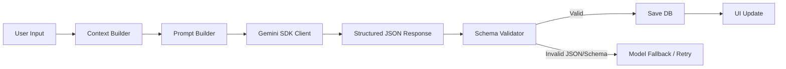

# Career Copilot — Technical Requirements Document

## 1. Technical Overview
This document outlines the technical design, architectural guidelines, and security practices for **Career Copilot**. It transitions the existing prototype into a production-ready, highly maintainable, and secure platform.

---

## 2. Existing Architecture

### Current Stack
*   **Frontend**: React (Vite, TypeScript, Tailwind CSS v4, Lucide-React). 
*   **Backend**: Node.js, Express, TypeScript (`tsx`).
*   **AI Integration**: `@google/genai` SDK using a fallback retry system across Gemini models.
*   **State & Storage**: Entirely in-memory React state (`useState`). There is no local storage caching or remote database connectivity.
*   **Deployment Configuration**: 
    *   `metadata.json` declaring AI Studio Applet capabilities.
    *   `.github/workflows/deploy.yml` deploying compiled relative-path static assets from the `dist/` folder to the `gh-pages` branch.

### Current Flow Chart (Vite + Express Monolith)
```mermaid
graph TD
    subgraph Client (Browser)
        A[index.html] --> B[main.tsx]
        B --> C[App.tsx Monolith]
        C --> D[React Memory State]
    end
    subgraph Server (Local/Hosting)
        E[server.ts] --> F[Vite Middlewares - Dev]
        E --> G[Express Routes - API]
        G --> H[Gemini Client / Fallback Retry]
        G --> I[Procedural Mock Fallbacks]
    end
    C -- Fetch requests --> G
    H -- API call --> J[Google Gemini API]
```

---

## 3. Target Architecture

The target architecture transitions the project into a standard **Three-Tier Architecture** (Frontend SPA, Backend API Service, and Relational Database) with file storage and secure user identity management.

```mermaid
flowchart TD
    subgraph Frontend (SPA)
        UI[React / Tailwind v4] --> Router[React Router v7]
        Router --> AuthState[Auth State - Context]
        Router --> APIClient[Axios / React Query]
    end
    subgraph Gateway & Load Balancer
        LB[Nginx / Cloudflare]
    end
    subgraph Backend API (Node/Express)
        Express[Express Server] --> AuthM[Auth Middleware]
        AuthM --> RouterM[API Router]
        RouterM --> Controller[Controllers]
        Controller --> Service[Services]
        Service --> AIService[AI Orchestrator]
        Service --> DBClient[Prisma Client]
    end
    subgraph Storage & Cloud Services
        PG[(PostgreSQL Database)]
        S3[S3 / GCS File Storage]
        AuthService[Supabase Auth / Auth0]
        Gemini[Google Gemini API]
    end
    
    UI <--> LB
    LB <--> Express
    DBClient <--> PG
    Service <--> S3
    Service <--> AuthService
    AIService <--> Gemini
```

### Components
*   **Frontend SPA**: Static assets served via CDN. Uses relative paths and a client router.
*   **Backend API**: Express server running inside a containerized environment (e.g. Google Cloud Run).
*   **Database**: Managed PostgreSQL instance (e.g. Supabase, Neon, or Google Cloud SQL) for persistent data storage.
*   **Authentication Service**: OAuth2 and JWT token-based identity platform (e.g. Supabase Auth, Clerk, or Firebase Auth).
*   **File Storage**: Object storage (e.g. AWS S3, Google Cloud Storage, or Supabase Storage) to store PDF/DOCX resumes.
*   **AI Integration**: Secure backend communication with the Gemini developer endpoints.

---

## 4. Technology Decisions

| Technology | Proposed Selection | Alternatives | Tradeoffs & Rationale |
| :--- | :--- | :--- | :--- |
| **Database** | **PostgreSQL (via Prisma ORM)** | MongoDB, SQLite | Relational schema is ideal for linking users to their roadmaps, milestones, and job cards. Prisma provides strong type safety that syncs with TypeScript. |
| **Authentication** | **Supabase Auth** | Clerk, Custom JWT | Supabase Auth provides free-tier OAuth and JWT verification middlewares. It integrates cleanly with Postgres and minimizes backend custom security logic. |
| **File Storage** | **Supabase Storage** | AWS S3, local storage | Storing resume files as raw binaries in the database degrades query performance. Supabase Storage is secure, free-tier friendly, and hooks directly into the database auth layers. |
| **Hosting (Server)** | **Google Cloud Run** | Render, Heroku | AI Studio projects integrate natively with Cloud Run, making deployment and secrets management seamless. |

---

## 5. Frontend Architecture
*   **Routing**: Implement **React Router v7 (or TanStack Router)**. Declare layouts (`DashboardLayout`, `AuthLayout`) and protect application routes using an auth-guard component.
*   **Component Modularization**: Split the monolithic `App.tsx` into:
    *   `/components/ui/`: Core styling primitives (Buttons, Inputs, Modals, Badges, Progress Bars).
    *   `/components/features/`: Complex modules (RoadmapTimeline, ResumeScreener, InterviewPanel, JobKanban).
    *   `/views/`: View-level pages mapping to routes.
*   **State Management**: Use **Zustand** for lightweight, persistent global states (like active sidebar position, profile settings). Use **TanStack React Query** for fetching, caching, and syncing server data (roadmaps, jobs, analysis).
*   **Forms & Validation**: Use **React Hook Form** paired with **Zod** schema validation to catch entry errors before sending payloads to the server.

---

## 6. Backend Architecture
*   **Modular Folders**:
    *   `/routes/`: Defines Express paths.
    *   `/middleware/`: Request filters (JWT Validation, Rate Limiting, File Parse, Error Handlers).
    *   `/controllers/`: Maps network endpoints to business logic.
    *   `/services/`: Handles database queries, file storage updates, and AI client orchestrations.
*   **AI Orchestration**: Isolated service layer that compiles prompt context, calls the Gemini SDK, validates the JSON output structure, and caches results to optimize costs.
*   **Error Handling Middleware**: Global Express catch-all wrapper that logs detailed error metrics to server outputs while returning sanitized, readable error messages to the client.

---

## 7. AI Architecture & Orchestration

To maintain safety and reliable UI rendering, all AI workflows follow this sequence:



### Prompt Management
Prompts must be stored in `/services/ai/prompts/` as structured templates rather than inline controller strings.
Example:
```typescript
export const ROADMAP_SYSTEM_INSTRUCTION = `You are an elite Tech Career Coach...`;
export const ROADMAP_USER_PROMPT = (role: string, duration: number, level: string) => 
  `Generate a career roadmap for a "${role}" spanning exactly ${duration} months at a ${level} tier...`;
```

---

## 8. API Specification

### 8.1 POST `/api/auth/register` (Proposed)
*   **Auth Required**: No.
*   **Request**: `email`, `password`, `name`.
*   **Response**: `201 Created` with JWT session object.

### 8.2 POST `/api/generate-roadmap`
*   **Auth Required**: Yes (Bearer JWT).
*   **Request**:
    ```json
    { "role": "Frontend Developer", "duration": 3, "skillLevel": "Beginner" }
    ```
*   **Response**: `200 OK`
    ```json
    {
      "roadmapTitle": "Frontend Developer Plan",
      "durationText": "3 Months",
      "months": [ { "monthTitle": "...", "weeks": [] } ]
    }
    ```
*   **Validation**: Schema validation via Zod. `duration` must be between 1 and 6.

### 8.3 POST `/api/resume-analyze`
*   **Auth Required**: Yes.
*   **Request**: Multipart form data with file attachment (`resume` file).
*   **Response**: `200 OK`
    ```json
    {
      "atsScore": 85,
      "compatibilityText": "Good compatibility",
      "suggestions": [ { "type": "quantify", "title": "..." } ]
    }
    ```
*   **Validation**: File must be PDF or DOCX, size < 5MB.

---

## 9. Authentication & Authorization
*   **Session Management**: The client stores the JWT session token securely in memory, or in an HTTP-only secure cookie set by the server (mitigating XSS).
*   **Protected Routes**: Router checks for session presence before mounting authenticated components.
*   **Ownership Checks**: The backend verifies that the requested record ID matches the verified `req.user.id` extracted from the JWT token.
    ```sql
    -- Example Database check
    SELECT * FROM "JobMatch" WHERE id = $1 AND "userId" = $2;
    ```

---

## 10. Security
*   **Secrets Protection**: Under no circumstances should `GEMINI_API_KEY` or database connection strings be referenced in frontend files.
*   **Input Sanitization**: Use libraries like `dompurify` on the client and sanitize input parameters on the server to prevent SQL injection and cross-site scripting (XSS).
*   **Rate Limiting**: Implement `express-rate-limit` to restrict API requests per IP address to protect against DDoS attacks and control Gemini API token costs.
    *   Auth routes: Max 10 requests per 15 minutes.
    *   AI generation routes: Max 5 calls per minute.
*   **File Upload Security**: Read file headers (magic numbers) to verify the mime type instead of trusting the file extension. Run files through virus scanners where possible.

---

## 11. Performance Targets
*   **First Contentful Paint (FCP)**: < 1.0s.
*   **Time to Interactive (TTI)**: < 1.5s.
*   **API Gateway Latency**: < 200ms.
*   **Resume Parsing & File Processing**: < 3.0s.
*   **AI Content Generation**: < 8.0s (supported by visual loading spinners in the client).

---

## 12. Reliability & Fallbacks
*   **Gemini Retry Strategy**: Implemented in [server.ts](file:///Users/apple/Desktop/careercopilot/server.ts). Try up to 3 models (`gemini-3.5-flash` -> `gemini-3.1-flash-lite` -> `gemini-flash-latest`) with exponential backoff on transient errors (503/429).
*   **Graceful Degradation**: If all Gemini models fail or the API quota is exhausted, intercept the error and return procedural data structures ([fallback.ts](file:///Users/apple/Desktop/careercopilot/src/utils/fallback.ts)) so the UI functions normally.
*   **Timeout Thresholds**: Terminate server requests if Gemini does not respond within 15 seconds to prevent memory leaks and hanging connections.

---

## 13. Testing Strategy
*   **Unit Tests**: Test utility libraries and UI styling primitives using Jest and React Testing Library.
*   **Integration Tests**: Validate routes, middleware logic, and db queries using Supertest and a local test database.
*   **AI Evaluation Tests**: Set up assertions that pass mock inputs to prompt compilers and verify that the output JSON matches Zod schemas.

---

## 14. Deployment
*   **Environments**: `development`, `staging`, `production`.
*   **CI/CD Pipeline**: GitHub Actions runs automated linting, test suites, and compiles assets. On successful builds, it deploys the container image to Google Artifact Registry and runs a service update in Google Cloud Run.
*   **Environment Variables**:
    *   `PORT`: Dynamic binding port.
    *   `GEMINI_API_KEY`: API credentials.
    *   `DATABASE_URL`: Connection string to PostgreSQL.
    *   `SUPABASE_JWT_SECRET`: Used to sign and verify session tokens.
    *   `SUPABASE_URL`: File bucket storage.
